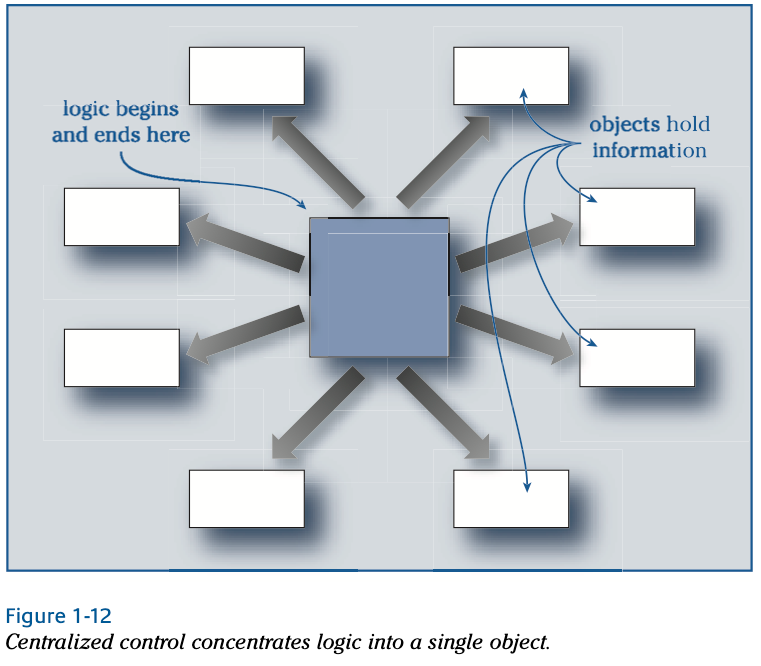

# Design Concepts

Alan Kay yazılım nesneleri için en sevdiği metafor biyolojik bir sistemdir. Hücreler gibi yazılım nesneleri de
birbirlerinin içinde ne olduğunu bilmezler ancak iletişim kurarak ve birlikte çalışarak karmaşık görevleri yerine
getirirler buna karşılık monolitik yazılım sayısız dişli içeren mekanik bir saat gibidir.

Bir yazılım nesnesi makine benzeri olabilir, ancak düşünceli bir tasarımcı tarafından oluşturulduğuğunda oldukça zeki
olabilir. Kararlar alır; işler yapar ve bilgi sahibidir. Potansiyel olarak bir çok diğer nesne ile işbirliği yapar bir
makinanın içinde yer alarak bir seviyede bir bütün başka bir seviyede ise bir parçadır bir makina ya da hücre gibi, bir
nesnenin davranışları,içine tasarlananlarla sınırlıdır. Hücreler ve nesneler programlanmış talimatları izler. Ancak bir
yazılım sisteminin dinamik davranışı, bir çok nesnenin etkileşimlerinden ortaya çıkar; her biri katkıda bulunur ve her
biri sorumlu bir rol oynar.

## Object Machinery

Tüm iyi sorular gibi, “Nesne nedir?” başka birçok soruyu da gündeme getirir. Nesneler bir problem hakkında düşünmemize
nasıl yardımcı olur? Nesne tabanlı uygulamalar nasıl farklıdır? Bir nesne çözümü bulduğumuzda, bunu başka amaçlar için
tekrar kullanabilir miyiz?

Hem donanım hem de yazılımda, en basit cihazlar dışında tümü parçalardan tasarlanır. Bu parçalar, birinin planına göre
etkileşimde bulunur. Fiziksel bir makinede, bu parçalar birbirine temas eder veya ortak bir ortam aracılığıyla iletişim
kurar. Etkileşimleri kuvvet oluşturabilir, hareket aktarabilir veya ısı iletebilir.

Yazılım makineleri, fiziksel makinelerle benzerdir. Bir yazılım uygulaması parçalardan oluşturulur. Bu parçalar,
yazılım nesneleri, diğerlerinden bilgi veya eylem talep etmek için mesaj göndererek etkileşimde bulunur. Her nesne,
yaşam döngüsü boyunca sabit bir istek setine yanıt vermekten sorumludur. Bu istekleri karşılamak için nesneler,
senaryolaştırılmış yanıtları ve bu yanıtların dayandığı bilgileri kapsüller (bkz. Şekil 1-1). Eğer bir nesne belirli
gerçekleri hatırlayacak şekilde tasarlanmışsa, gelecekteki isteklere farklı yanıt vermek için bu bilgileri kullanabilir.

Peki bu yazılım makinalarını nasıl icat ederiz?

Nesne yönelimli bir uygulama oluşturmak, uygun makineleri icat etmek anlamına gelir. Gerçek dünyadaki bilgileri,
süreçleri, etkileşimleri, ilişkileri ve hatta hataları, gerçek dünyada var olmayan nesneler icat ederek temsil ederiz.
Cansız şeylere hayat ve zeka veririz. Gerçek dünyadaki karmaşık nesneleri alır ve onları daha basit, daha yönetilebilir
yazılım nesnelerine böleriz.


**Nesne yönelimli yazılım geliştirme sürecinin merkezinde, gerçek dünya fiziğinin bir ihlali vardır. Dünyayı yeniden
icat etme lisansımız var, çünkü makinelerimizde gerçek dünyayı modellemek bizim amacımız değil**

Yeni nesneler icat ederiz. Her birinin uygulamada oynayacağı belirli bir rolü vardır. Başarımızın ölçüsü, yazılımın
gerçek dünyaya ne kadar benzediği değil, uygulamanın gereksinimlerini ne kadar net bir şekilde karşılayan bir yazılım
gerçekliği icat ettiğimizdir.

Örneğin, bir form doldurmak ve dosyalamak basit gibi görünse de, yazılımda bu görevi yerine getirmek için, basit
formların arkasında uygulama, verileri iş kurallarına karşı doğrulamakta, kalıcı verileri okumakta ve güncellemektedir,
bilginin tutarlılığını sağlamaktadır ve onlarca kullanıcının eşzamanlı erişimini yönetmektedir. Yazılım nesneleri bilgi
gösterir, etkinlikleri koordine eder, hesaplama yapar veya hizmetlere bağlanır. Bu makinenin büyük kısmı bizim
icadımızdır! Gerçek dünya metaforunu formlar ve dosyalar olarak izleriz, ancak nesne modelimiz, nesneler olarak
gerçekleştirilen çok daha zengin bir kavram setini içerir.

Makine benzeri davranışlara sahip oldukları ve birlikte çalışacak şekilde bir araya getirilebilecekleri için, nesneler
çok karmaşık makineler inşa etmekte kullanılabilir. Bu karmaşıklığı yönetmek için, sistemin davranışlarını iyi
tanımlanmış rolleri olan nesnelere bölüyoruz. Davranışa odaklanmaya devam edersek, uygulamayı birkaç tamamlayıcı bakış
açısıyla tasarlayabiliriz:


* An application = Etkileşimde bulunan bir nesne seti

* An object = Bir veya daha fazla rolün implementasyonu

* A Role = İlgili sorumluluklar seti

* A responsibility = Bir görevi yerine getirme veya bilgi sahibi olma yükümlülüğü

* A collaboration = Nesnelerin veya rollerin (veya her ikisinin) etkileşimi

* A contract = Bir işbirliğinin koşullarını belirleyen bir anlaşma

**Etrafımızdaki sonsuz farkındalık manzarasından bir avuç kum alır ve o avuç kumu dünya olarak adlandırırız. Kumu
avuçladığımızda, bilinçli olduğumuz dünya, onun üzerinde bir ayrım yapma sürecine başlar. İşte bu bıçaktır. Kumları
parçalara ayırırız. Şu ve bu. Burada ve orada. Siyah ve beyaz. Şimdi ve sonra. Ayrım, bilinçli evrenin parçalara
bölünmesidir.**

## ROLES

Hiçbir nesne yalnız başına var olmaz. Her zaman daha büyük bir makinenin parçasıdır. Uyum sağlamak için, bir nesnenin
belirli bir amacı vardır; bulunduğu context'de oynadığı bir rol. Aynı rolü oynayan nesneler birbirinin yerine geçebilir.
Örneğin, mektup ve paketleri teslim edebilen birkaç sağlayıcı vardır: DHL, FedEx, UPS, Post, Airborne. Hepsi aynı amaca
sahiptir, belki işlerini yürütme şekilleri farklıdır. Teslimat için sahip olduğunuz gereksinimlere göre içlerinden
birini seçersiniz. Bir günde mi, kitap tarifesiyle mi, değerli mi, ağır mı, yanıcı mı? Gereksinimlerinizi karşılayan
posta taşıyıcıları arasında seçim yaparsınız.

**Bir rol, birbirinin yerine kullanılabilecek bir sorumluluklar setidir.**

Bir nesneyi düşünürken, “Hangi rolü oynuyor?” diye sormak faydalıdır. Bu, onun ne olması gerektiğine ve ne yapması
gerektiğine odaklanmamıza yardımcı olur. Nesneler ve roller hakkında gevşek bir şekilde konuşuyorduk. Gerçek fark nedir?
Bir rol her zaman aynı tür nesne tarafından oynandığında, ikisi de eşdeğerdir. Ancak birden fazla tür nesne aynı
sorumlulukları topluluk içinde yerine getirebiliyorsa, bir rol, farklı şekillerde yerine getirilebilecek bir
sorumluluklar seti haline gelir. Bir rol, program çalışırken uygun bir nesne ile doldurulacak yazılım makinesindeki bir
yerdir.

## OBJECT ROLE STEREOTYPES

**Tıpkı bir aktörün bir oyunda inandırıcı bir rol oynamaya çalışması gibi, bir nesne de anlamlı bir rolü tanımlayan
sorumlulukları üstlenerek bir uygulamada bir karakter alır.**

İyi tanımlanmış bir nesne, net bir şekilde tanımlanmış bir rolü destekler. Bir nesnenin sorumluluklarına odaklanmamıza
yardımcı olmak için amaçlı basitleştirmeler veya role stereotype'ları kullanırız. StereoType'lar, bir uygulamanın
ihtiyaç duyduğu rollerin karakterizasyonlarıdır. Amacımız tutarlı ve kullanımı kolay nesneler inşa etmek olduğundan,
nesneleri stereotype'lamak, davranışlarının ayrıntılarını göz ardı ederek daha yüksek bir seviyede düşünmek açısından
avantajlıdır. Basitleştirerek ve karakterize ederek, bir nesnenin rolünün doğasını daha kolay inceleyebiliriz. Bu
stereotype'ların faydalı olduğunu düşünüyoruz:

* Information holder - Bilgiyi bilir ve sağlar

* Structurer - Nesneler arasındaki ilişkileri ve bu ilişkilerle ilgili bilgileri korur

* Service provider - İş yapar ve genel olarak hesaplama hizmetleri sunar

* Coordinator - Task'ları başkalarına delege ederek event'lere tepki verir

* Controller - Kararlar alır ve başkalarının eylemlerini yakından yönlendirir

* Interfacer - Sistemimizin farklı parçaları arasında bilgileri ve istekleri dönüştürür.

**Yazılım makineleri, bilgilerin hesaplanması, ilişkilerin sürdürülmesi, dış programlar ve cihazların kontrolü,
bilgilerin görüntü için biçimlendirilmesi, dış eventlere ve inputlara yanıt verme, hata yönetimi ve karar verme
işlemlerinden oluşur.**

Bir nesnenin rolünü atayıp karakterize ettikten sonra, ona ait sorumluluklar da belirlenecektir. Bir nesne birden fazla
stereotype'a uyum sağlayabilir.

Bir mi yoksa iki mi rol oynuyor? Sıklıkla bir service provicer'in service'ini sunmak için ihtiyaç duyduğu bilgileri
tuttuğunu görürüz. Bu durumda, Information Holder ve Service Provider olmak üzere iki stereotype üstlenir, ancak
sorumluluklar aynı client'ların kullanımına yönelik bir arada toplandığı için yalnızca bir rol oynar. Eğer bilgisi
yalnızca service'ini desteklemek için kullanılıyorsa, iki stereotype üstlenir, ancak yalnızca bir rol oynar. Ancak, eğer
iki farklı türdeki client'a farklı amaçlar için service verdiği algılanıyorsa, muhtemelen iki rol oynamaktadır.

Bazı nesneleri stereotype'lamak zordur çünkü birden fazla kategoriye uyuyormuş gibi görünürler. Belirsizdirler. Nasıl
seçim yapabilirsiniz? Ne üzerinde durmak istediğinizi belirlemelisiniz. Eğer güç iletimini vurguluyorsanız, bir şanzıman
bir service provider'dir. Eğer motor ve tekerleklerle olan bağlantılarını vurguluyorsanız, bir interface olarak kabul
edilir. Nesnelerin birden fazla stereotype'i olabilir mi? Eğer birden fazla yönü vurgulamak istiyorsanız, bu sorun
değil. Vurguların karışımları olduğu gibi, stereotype'ların da karışımları vardır.

## ROLES, RESPONSIBILITIES, AND COLLABORATIONS

Bir uygulama, bir sorumluluklar sistemi implement eder. Sorumluluklar rollere atanır. Roller, bu sorumlulukları yerine
getirmek için işbirliği yapar. İyi bir uygulama, bu sorumlulukları etkili bir şekilde yerine getirecek şekilde
yapılandırılır. Tasarıma, nesneler icat ederek ve bunlara bilgi edinme ve uygulamanın işlerini yapma sorumluluklarını
atayarak başlarız. Bu nesneler toplu olarak, uygulamanın daha büyük sorumluluklarını yerine getirmek için birlikte
çalışır.

Bir nesne, bir şeye ihtiyaç duyduğu için başka bir nesneye çağrıda bulunur veya onunla işbirliği yapar. Her iki taraf da
bu sürece dahildir. Biri yardıma ihtiyaç duyar; diğeri bir service sunar. Nesneler, daha büyük sorumlulukları yerine
getirmek için birlikte çalışır. İşbirliklerini tasarlamak, nesneleri izole bireyler olarak değil, işbirliği yapan
ortaklar olarak düşünmemizi sağlar. Tasarım, nesneleri ve sorumluluklarını hayal etmenin ve küçük gruplar içinde esnek
işbirlikleri icat etmenin yinelenen ve kademeli bir sürecidir.

Bir nesnenin sahip olduğu service'ler ve sağladığı bilgiler, diğer nesnelerle bir arada olduğunda nasıl davrandığını
tanımlar. Tasarımın erken aşamalarında, belirli sorumlulukların nesnelere kümelendiğini bilmek yeterlidir. Her şeyden
önce, bir nesne başkalarına bilgi sağlama ve iş yapma sorumluluğuna sahiptir. Bir tasarım modeli, sorumlulukları
nesneler arasında düzenler.

**Bir nesne, belirlenmiş bir sorumluluklar kümesiyle bir dizi rolü bünyesinde barındırır.**

**Rollerini yerine getirirken amacına sadık kalan açıkça tanımlanmış nesnelerin, anlaması ve bakımını yapması daha
kolaydır.**

**Nesneleri daha akıllı hale getirmek, sistemi de daha verimli kılar. Nesneler, asıl amaçlarına bağlı kalıp, ana
görevleriyle ilgisi olmayan detaylarla uğraşmak yerine belirli görevlerine odaklanabilirler.**

Şekil 1-2'de gösterildiği gibi, bir uygulama birlikte çalışan bir nesneler topluluğudur. Nesneler, istek gönderip yanıt
alarak işbirliği yaparlar. Her nesne sorumludur. Her biri kendi bilgi ve service'lerini sunar.

Bir nesne, bildiklerini kullanarak bir şey yaptığında daha akıllı hale gelir. Ne kadar akıllı olursa, bir client'in
service'lerini kullanmak için bilmesi gereken ayrıntılar o kadar azalır. Böylece client, ona söylenebilecek bir şeyi
çözmeye çalışmak yerine, kendi işini yapma özgürlüğüne kavuşur. Stereotypeların harmanlanması, bu hibritleri kullanan
client'ların sorumluluklarını daha kolay, daha verimli ve amacına uygun hale getirir. Bu tür client'lar, yardımcılarının
yapabileceği küçük ayrıntıları bir araya getirmek yerine kendi sorunlarına odaklanabilir. Nesneleri daha akıllı hale
getirmek, genel olarak tüm topluluğun zekasını artıran bir etkiye sahiptir.


**Nesneler, tek başlarına çözemeyecekleri daha büyük sorunları çözmek için işbirliği yaparlar.**

Nesneler işbirliği yaptıklarında, belirli protokolleri takip ederek ve belirli kurallara uymak üzere tasarlanmışlardır:
Yalnızca ilan edilen service'ler için istek yapın. Uygun bilgileri sağlayın. Service'leri belirli koşullar altında
kullanın. Son olarak, bunları kullanmanın sonuçlarını kabul edin. Nesne contract'ları, tüm bu şartları tanımlamalıdır.

Ancak, belirli bir nesnenin değeri komşuları tarafından belirlenir. Tasarımımızı oluştururken, her nesnenin yakın
çevresine olan değerini sürekli olarak göz önünde bulundurmalıyız. Yararlı bir service sağlıyor mu? Onunla iletişim
kurmak kolay mı? Sürekli yardım istemesi bir rahatsızlık mı? Etkileri istenen sonuçları mı veriyor? Bir nesnenin yaptığı
talepler ne kadar azsa, kullanımı o kadar kolaydır. Üstlenebildiği görevler ne kadar fazlaysa, o kadar yararlıdır. Eğer
bir nesne, yardımcı olarak sağlanabilecek çok farklı nesne türlerini barındırabiliyorsa, sorumluluklarını yerine
getirmek için etrafında ihtiyaç duyduğu belirli nesne türleri hakkında daha az talepte bulunur. Nesnelerin
client'larının bu detayları bilmesini istemesek de, tasarımcılar olarak bu durumu göz önünde bulundurmamız gerekiyor.
Her nesnenin, komşularına koyduğu gereksinimler ve taleplerle, client'larına sunduğu olanaklar arasında bir denge
kurmalıyız.

Roller! Sorumluluklar! İşbirlikleri! Yazılım makinelerimizin davranışlarına odaklanmak için her bir faaliyetimizde
roller-sorumluluklar-işbirlikleri modelini kullanıyoruz. Problemi anlama seviyemiz arttıkça, nesnelerimizin rolleri ve
sorumlulukları evrim geçirir. Community'nin mahallelerini ve etkileşim biçimlerini tasarlar ve yeniden tasarlarız. Nesne
rollerini yeniden icat eder ve sorumlulukları bunlar arasında kaydırırız, ta ki hepsi “uyum sağlasın”, birlikte
çalışsın, dış kısıtlamaları karşılasın ve sorumlulukları açıkça amaçlarını desteklesin. Daha fazla detayı netleştiririz
ta ki sorumlulukları çalıştırılabilir koda bağlayabileceğimiz noktaya ulaşana kadar.

## OBJECT CONTRACTS

**Bir nesne sözleşmesi, nesnenin işini garanti ettiği koşulları ve işinin tamamlanmasının ardından bıraktığı etkileri
açıklar.**

İyi sınırlandırılmış durumlarda, bir nesnenin etkileşimde bulunduğu kişiler, kullanıldığı koşullar ve bir nesnenin
çevresi üzerindeki uzun vadeli etkileri hakkında oldukça fazla bilgi edinmek mümkündür. Bu bilgiler nesne
sözleşmelerinde açıklanmıştır.

Bunlar, bir nesnenin sorumluluklarını derinleştirir ve tasarımımıza olan güvenimizi artırır. Bu şeylerin nasıl
gerçekleştirileceğini söylemeden, bu sorumlulukların ne zaman çağrıldığını gösteren koşulların kullanım garantilerini (
conditions-of-use guarantees) ve tamamlandıklarında bıraktıkları izleri (aftereffect guarantees) ortaya
koyarlar.

### Conditions-of-Use and Aftereffect Guarantees

Kimlerin kimlerle iş birliği yaptığını bilmek, iş birliğinin ne zaman başarılı olacağı hakkında hiçbir şey söylemez.
"Benden ne bekliyorlar? Hangi koşullar altında service'lerimi garanti ediyorum? Methodlarım yalnızca bu sırayla
çağrılabilir!" Tasarımcının nesnenin isteği yerine getireceğinden emin olması için, nesnenin context'ine koyduğu
gereksinimler, kullanım koşullarında tanımlanmalıdır. Her sorumluluk için, davranışını etkileyen herhangi bir nesne veya
iç değer (veya her ikisi) not edilmelidir ve bunlar üzerindeki herhangi bir kontrol tanımlanmalıdır.

Bu sözleşmenin ayrıntıları, her service için kullanım koşullarını ve nesnenin service'lerinin kullanımının sonrasında
ortaya çıkan etkileri belirler. Bir nesne, belirtilen kullanım koşulları dışında kullanıldığında, isteği yerine
getirmekle yükümlü değildir! Eğer bir Hesap nesnesinin nakit çekme sorumlulukları varsa, kullanım koşulları nelerdir?
Bunlardan biri, bakiye miktarınca veya daha fazla olmasıdır! Ya da bu, bireysel müşterilere ilişkin banka politikalarına
bağlı olarak daha karmaşık olabilir. Bu kullanım koşullarını tanımlama çabasının sonucunda güvenilirlik ve dayanıklılık
artar.

Unutmayın ki, bir nesnenin diğerleriyle olan sözleşmeleri, onlarla nasıl etkileşimde bulunduğunu, işini garanti ettiği
koşulları ve topluluğun diğer üyeleri üzerinde bıraktığı etkileri tanımlar. Tasarım açısından, belirli service'lerin
interface'lerde kümelendiğini ve bu service'lerin birbirlerini çağıracağını ve doğru koşullar altında başarılı olacağını
bilmek yeterlidir.

## DOMAIN OBJECTS

Domain nesneleri, geliştiriciler ve kullanıcıların uygulamayı tartışabilecekleri ortak bir zemin sağlar. Domain
nesneleri, belirli bir ilgi Domain'indeki kullanıcılara ve uzmanlara tanıdık olan kavramları temsil eder. Bir banka
uygulaması hakkında konuşurken hesaplar, mevduatlar, para çekme işlemleri, faiz oranları gibi kavramlarla düşünürüz. Bir
havayolu rezervasyon uygulamasında ise rezervasyonlar, uçaklar, koltuklar, varış noktaları, programlar gibi kavramlarla
konuşuruz ve bunlar yazılım nesne modelimizde bulacağımız kavramlardır. Daha sonra, temel yapıların ve kodun
geliştirilmesi ve yazılımı kullanma senaryolarının çalıştırılması sürecine geçiyoruz. Kullanıcılar ve uzmanlar, bu
Domain kavramlarına tanıdık olduklarından, uygulamanın bu yönlerini kolayca tartışabilirler. Bu Domain nesnelerinin
bilgilerini doğrudan manipüle etmekte kendilerini rahat hissederler ve bu nesnelerin service'lerini talep etme
prosedürlerini anlarlar.

Geliştiriciler için bu Domain nesneleri, Domain'in bir modelini oluşturmak ve yazılım makinelerinde var olacak bu ve ek
kavramların internal temsillerini geliştirmek için sadece bir başlangıçtır. Orijinal, “common” kavramlar yürütülebilir
sistemde değerli olmayabilir, ancak tasarım boyunca izlenebilir olmalıdır çünkü bu kavramlar, paydaşların uygulama ile
ilgili anlayışlarını ve sorunlarını açık bir şekilde ifade eder.

**Her yazılım tasarım çabası bir Domain modeli oluşturarak başlamasa da, çoğu tasarım, uygulama tarafından desteklenen
belirli Domain ile ilgili uzmanlar için tanıdık olan kavramları temsil eden belirli nesneleri içerir.**

Nesne yönelimli bir uygulamada, Domain, kullanıcının ihtiyaç duyduğu bilgi ve service'lerden oluşur ve bunları
ilişkilendiren yapıları içerir (bkz. Şekil 1-3). Örneğin, bir envanter kontrol sistemi, mevcut stokun izlenmesi (bilgi),
stoku ekleme ve çıkarma (services) ve ilgili stok koruma politikalarını destekleme (ilişkiler) ile ilgilidir. Bu üç
unsur (bilgi, service ve yapılar), hemen hemen tüm veri odaklı uygulamalara uygulanır ve bu rolleri yerine getiren
nesnelerin geliştirilmesinde bize rehberlik eder.

Bir Domain modelindeki nesneler, etkileşimlerinde uygulamanın mantığını somutlaştırır. Domain modeli, uygulamanın ve
çevresine tepkilerinin anlamını en abstract seviyede yakalar. Bu model, bir Domain'in tüm kavramlarını değil, yalnızca
uygulamanın planlanan kullanım senaryolarını desteklemek için gerekli olanları temsil eder.


**Bir Domain modeli, gerçek dünyadaki tüm Domain'i temsil etmez. Sadece uygulamayı desteklemek için gerekli olan
kavramları içerir.**

Domain modelindeki bireysel nesneler, kullanıcı eylemlerine yanıt verme ve kullanıcının ihtiyaç duyduğu yeni bilgileri
oluşturma konusundaki gerçek, concrete sorumlulukları taşır. Eğer sadece bir arabayı tanımlıyorsak ve bilgisayarda
çalıştırmak için bir model oluşturmuyorsak, çerçeve, motor, şanzıman, direksiyon, direksiyon kutusu, direksiyon mili,
tekerlekler ve frenler gibi unsurları içeren bir Domain modeli oluşturmak yeterlidir. Ancak bunu bilgisayarda
çalıştırmamız ve kullanıcı etkileşimlerini tasarlamamız gerektiğinde, gerçek dünya yarış arabalarının birçok önemli
davranıştan yoksun olduğunu görürüz. Daha zengin bir nesne setine ve bilgisayar oyunundaki bir simüle edilmiş yarış
arabası Domain'ine ihtiyacımız vardır. Tasarım probleminiz için doğru Domain'i seçmek ve bir Domain'de çalışmak üzere
tasarlanan nesnelerin, başka, görünüşte benzer bir Domain'e kolayca geçemeyeceğini kabul etmek önemlidir.

Örneğin, bir yarış arabası simülasyonunda, kokpit, yarış pisti ve rekabet eden arabaların ekranda görsel görüntüler
olarak görünmesi gerekir. Gerçek dünya yarış arabası domain'inden bu işlevi yerine getirecek bir nesne var mı? Yok! Bu
özel amaç için, program görüntülerini sunacak ve kullanıcı inputunu yakalayacak bir nesne icat etmeliyiz: bir
interfacer.

## APPLICATION-SPECIFIC OBJECTS

Benzer şekilde, bilgisayarın kullanıcı girdilerini (fare tıklamaları, joystick hareketleri) yarış uygulamasındaki uygun
nesnelere komutlar olarak çevirmek için nesnelere ihtiyacımız var. Bu nesneler, kullanıcı bilgilerinin dönüştürülmesini
veya filtrelenmesini sağlar ve ardından diğer uygun nesneleri harekete geçirebilir. Veya bir ekran görüntüsünden
diğerine hareketi sıralayabilir, yarış pistinin görünümlerini değiştirebilir ve heyecan verici kazaların görüntülerini
ve seslerini yeniden oynatabilirler. Bu bilgisayar ve uygulama özel nesneleri — interface'ler, coordinators ve special
service providerlar simüle edilmiş yarış arabasının domain modeline program özel davranışlar ekleyerek uygulamayı bir
araya getirir.

Deomain modelinden yazılımın gerçek işleyişinde önemli olan nesnelere geçerken, birçok uygulama nesnesi ile
karşılaşırız.

Örneğin, tipik bir uygulama başlatıldığında, ilk nesne grubunu oluşturan en az bir özel başlangıç nesnesi bulunur. Bu
grup başlatıldığında ve hazır olduğunda, başlangıç nesnesi kontrolleri onlara devreder. Uygulama başlar ve çalışır.
Kullanıcı uygulama içinde gezinirken, bu ilk nesne grubu, ya uygulamanın gereksinimlerini doğrudan yerine getirerek ya
da belirli amaçlar için tasarlanmış yeni bir nesne grubuna iş oluşturarak ve delege ederek kullanıcı eylemlerine yanıt
verir. İşlem devam ettikçe, bu nesne topluluğunun yeni üyeleri, uygulamanın ihtiyaçlarına (ve tasarımına) bağlı olarak
doğar, yaşar ve ölür.

Tasarımcılar, diğer paydaşların bakış açılarına “true” (bir şekilde) olan yürütülebilir bir uygulama oluştururlar; bu
uygulama, girişleri ve kullanıcı olaylarını izleyen, uygulamaya özel veri biçimlendiricileri, dönüştürücüler ve
filtreler gibi birçok yeni uygulama özel nesnesi ekler; ve dış dünya ile veri tabanları, cihazlar, ağlar ve diğer
bilgisayar programları ile etkileşime geçen diğer nesneler (bkz. Şekil 1-4). Geliştiricilerin doğal olarak daha
ayrıntılı bir görünüme ihtiyacı vardır.

Kullanıcıların ve tasarımcıların bakış açıları, uygulamalar ve nesneler hakkında iki farklı düşünce seviyesini temsil
eder. Kullanıcı bakış açısı, ele alınan domain'in en yüksek düzeydeki kavramlarının — bilgi, service'ler ve
rules—temsilini taşır.

Tasarımcı, uygulamayı temelde farklı, daha düşük bir düzeyde—bilgisayar process'leri, hesaplamalar, çeviri, koşullu
yürütme, delege etme ve girişler ve çıkışlar düzeyinde düşünerek diğer sistemlerle ve cihazlarla koordinasyon ve
bağlantı yönlerini icat eder. Başarılı bir uygulama geliştirmekteki anahtar, tasarımcılar olarak bu iki bakış açısını
birbirine uyumlu bir şekilde birleştirebilme yeteneğimizde yatar; bu süreçte hiçbirinden ödün vermemeliyiz.


**Bir uygulama modeli, kullanıcıya yanıt verme, yürütmeyi kontrol etme ve dış kaynaklarla bağlantı kurma için
bilgisayara özgü nesnelerle domain modelini tamamlar.**

## INTERFACES

Sonunda, bir nesne başkalarına bilgi verme ve görev yapma sorumluluklarını, kod içeren methodlar ile ifade eder. Bir
interface, bir nesne ile kullanıcıları arasındaki diyalogda kullanılan kelime dağarcığını tanımlar: “Ayakkabılarımı
parlat. Ayakkabılarımı ver. Bu beş dolar, lütfen. İşte makbuzunuz.” Interface, service'leri tanıtır ve bunların nasıl
talep edileceğini açıklar.

Bir interface'in neyi declare ettiğini bilmek genellikle yeterli değildir. Bir nesnenin service'lerini kullanmak için,
bir service'in ne zaman çağrılabileceği gibi koşullar önemli olabilir. Ya da önemli bir side effect'in ortaya çıkması
gerekebilir.

Bir makinedeki bir dişli çarkı düşünün. Diş sayısı ve dişler arasındaki mesafe dişlinin interface'ini tanımlar. Bu, bir
dişlinin bir makineye uyup uymayacağını belirler. Ancak ya bir dişliyi başka bir alaşımdan yapılmış bir dişliyle
değiştirirsek? Bu yeni dişli interface'e uyar, ancak dişliler döndükçe farklı gerilme yükü özellikleri nedeniyle aşırı
ısınma ya da kırılma eğilimi gösterebilir. Interface bu gerçek dünya kısıtlaması hakkında hiçbir şey söylemez.

Bir nesnenin davranışı hakkında ne kadar çok bilgi yayınlarsak, o kadar çok tasarımcısının amaçladığı şekilde
kullanılması olasıdır. Bir client'in bakış açısından, bir nesne interface'inden daha fazlasıdır:


**Bir nesne interface'leri implement eder ve diğer nesneleri etkiler.**

**Bir nesnenin tasarımını üç parçaya ayırırız: public interface, kullanım şartları ve koşulları ile işlerini nasıl
yürüttüğüne dair özel detaylar. Bir nesnenin iç mekanizmasının tasarımcıları, nesnenin sorumluluklarını nasıl yerine
getirdiğiyle ilgilenmelidir.**

Peki ya information hiding (bilgi gizleme?) Burada bir nesne hakkında her şeyi açığa çıkarmaktan bahsetmiyoruz, sadece
client'i ilgilendiren service'ler ve koşullar. Nesnemizin mekanizmasının nasıl çalıştığını kasten gizliyoruz. Bir nesne,
topluluğun yarı-özerk bir üyesidir ve şöyle der: 'İşimi nasıl yaptığım sizi ilgilendirmez, yeter ki anlaşmamıza uygun
şekilde yapayım!'

Client'ların içeriye bakıp işimi nasıl yürüttüğümü görmelerini istemiyorum. Gizlenmesi gereken şey, nesnenin
implementasyonudur, ondan ne beklenmesi gerektiği değil.

## CLASSES

Sınıf terimi, matematikte ve günlük hayatta benzer şeyler topluluğunu tanımlamak için kullanılır. Bu öğelerin tümünü
genel bir şekilde tanımlar, ancak sınıfın her bir instance'inin önemsiz özelliklerde farklılık göstermesine olanak
tanır.

Sınıf abstract ve kavramsal iken, instance'lar concrete ve fiziksel nesnelerdir. 'Ağaç' kelimesinin zikredilmesiyle
zihnimizde beliren görsel imge, herhangi bir ağaç örneğini gördüğümüzde onu tanımamızı sağlayan temel özellikleri
içerir.

Spor arazi araçlarını bir kenara bırakırsak, bir aracın bir araba mı yoksa kamyon mu olduğunu, tariflerden birine
uyduğunda kolayca ayırt ederiz.

Sınıfın bu günlük kavramı yazılım nesneleri için de geçerlidir. Uygulamalarımızı benzer nesnelerden oluşan setlerden
oluştururuz. Ancak bir yazılım sınıfının yazılım dünyasına özgü bazı özellikleri vardır. Nesneye yönelik bir programlama
dili, bir programcının sınıflar kullanarak nesneleri tanımlamasına ve metodlar kullanarak bunların davranışlarını
belirlemesine olanak tanır. Nesneye yönelik bir programlama dilinin ek gereksinimleri de vardır, ancak bu iki özellik
temel olanlardır. Nesnelerden bir uygulama oluşturmak için ihtiyacımız olan her şeyi sağlarlar.

Matematiksel bir sınıfın aksine, bir yazılım sınıfı sadece bir abstraction değildir. Tanımladığı instance gibi,
concretedir

Onu görmek için hiçbir şey hayal etmenize gerek yoktur, çünkü index card'larda tanımlanmış, bir tasarım notasyonu
ile şemalandırılmış ve programlama kodunda yazılmıştır. Onu alıp çevirebilir, tanımını okuyabilirsiniz. O bir nesnedir.
Sınıfa verdiğimiz özellikler, onun instance'larında olmasını istediğimiz özelliklerdir. Instance'larına atadığımız her
bir 'knowing (bilme)', 'doing (yapma)' veya 'deciding (karar verme)' sorumluluğu, sınıf tanımında ve sınıfın içerdiği
instance metodlarında concrete hale gelir

### TWO ROLES

**Sınıflar iki rol oynar. İlk olarak, instance'ları oluşturan ve onların adına sorumlulukları implement eden factory'ler
gibi hareket ederler. İkinci olarak, neighborhood'larda ki client'lara service eden bağımsız provider'lar olarak görev
yaparlar**

Eğer bir yazılım sınıfı iki ayrı service seti sağlıyorsa, genellikle iki farklı türdeki client'lara, bu sınıfın iki rol
oynadığı söylenir. İlk olarak, gerçek dünya analoğu olmayan bir rol üstlenir. Program yürütülürken, bir sınıf, programın
ihtiyaç duyduğu instance'ları üretmek veya oluşturmak için bir factory gibi hareket eder (bkz. Şekil 1-5). Bilgisayar
belleğini fiziksel, elektromanyetik nesnelerle doldurur ve bu bellek alanlarını sorumlu oldukları talimat setlerine
bağlar. Tasarım gereksinimlerimizi karşılamak için icat ettiğimiz abstract makineler, roller ve sorumluluk kümeleri olan
tasarım nesnelerimiz, program kodunda sınıflara dönüşür.


**Bir sınıf, factory olarak hareket ettiğinde, uygulamanın ihtiyaç duyduğu nesneleri üretir (oluşturur).**

Bir sınıf, instance'ları inşa etmek için blueprint'leri barındırır. Bir dizi instance metodu tanımlayarak, diğer
client nesnelerinin kullanabileceği davranışların isimlerini declare eder. Bir instance, bir client'dan gelen bir isteğe
yanıt verdiğinde, sınıfında tanımlanan ilgili metodu gerçekleştirir.

Instance'larin bir görevi nasıl yerine getirdiğine dair detaylar, instance'in sınıf tanımında ve instance metod
tanımları koleksiyonunda belirlenmiştir. Instance nesnesinin sınıfını ve instance metodlarını inceleyerek, örneğin
sorumluluklarını yalnız mı yerine getirdiğini yoksa görevlerinin bir kısmını komşuluğundaki diğer nesnelere mi delege
ettiğini görebilirsiniz.

Sınıflar, uygulamamızın yapı taşlarıdır. Bir nesneyi, sınıfında tanımlanan özellikler ve işlemler aracılığıyla nasıl
tanımlıyorsak, instance'lar arasındaki ilişkileri de sınıflar arasındaki ilişkilerle tanımlarız. Örneğin, insanlar ve
arabalar arasındaki milyonlarca sahiplik ilişkisi, bu iki sınıf arasındaki tek bir sahiplik ilişkisine indirgenebilir.

Bir sınıf, nesne factory'si rolünün yanı sıra, kendi sorumlulukları olan bir nesne olarak da hareket edebilir. Bu rolde,
kendi interface'i aracılığıyla diğer nesnelere bilgi ve service sağlar. Genellikle, tek client'ları ürettiği instance'
lardır, ancak diğer durumlarda, birçok farklı türdeki nesnelere veri ve service sağlayan tek kaynak olarak hareket eder.

Aslında, Şekil 1-6'da gösterildiği gibi, kendi türünde tek bir nesnenin yeterli olduğu durumlarda, bir sınıf instance
factory rolünü bırakarak ihtiyaç duyulan nesne rolünü üstlenecek şekilde tasarlanabilir.


Aynı koşullar altında, belirli bir sınıfın tüm instance'ları aynı şekilde davranır. Benzer nesnelerden oluşan bir set
oluştururlar. Her biri diğerleriyle aynı yapıya ve aynı türdeki diğerleriyle paylaştığı bir dizi metoda sahiptir. Her
instance, kendi iç veri alanlarına sahip ayrı bir nesne olduğundan, başka hiçbir nesneyle paylaşmadığı özel verileri
tutabilir. Bir sorumluluğunu yerine getirmesi istendiğinde, bu özel verilere dayanarak yanıt verebilir. Akıllı bir
nesne, sorumluluklarını nasıl yerine getirdiğine dair kararlarını etkileyen verileri encapsulate eder.

Her bir instance, görevlerini iki context'de yerine getirir. İçinde bulunduğu topluluk tarafından belirlenen kurallara
göre davranır ve kendi özel kuralları ve verilerine göre eylemlerini kontrol eder. Kurallar genellikle programlama
dilindeki koşullu ifadeler olarak metodlara yerleştirilmiştir. Bir nesnenin durumu, instance variable'larında tutulan
verilerle yansıtılır. Bu variable'lar, bir nesnenin iç yapısını tanımlar ve bir nesnenin çevresindeki diğerlerini
görmesinin bir yoludur; bir nesne, diğerlerine referanslar tutabilir. Bu referanslar, bir nesnenin diğerlerini '
görmesini' ve ardından onlarla etkileşime girmesini sağlar. Bu referanslar, nasıl etkileşime girdikleri hakkında hiçbir
şey söylemez—sadece işbirliği potansiyelinin var olduğunu belirtir.

**Nesnenin üç özelliği vardır ve bu onu basit ama güçlü bir model yapı taşı yapar. Belleği modelleyebilmesi için bir
State'i vardır. Dinamik süreçleri modelleyebilmesi için bir Behavior'u vardır. Ve complexity'i gizleyebilmesi için
encapsulate edilmiştir**

## COMPOSITION

**"Bir soy ağacı, bir grup insanın yapısal ilişkilerini tanımlar. Bir kişi, soy ağacına iki şekilde eklenir: evlilik
yoluyla veya doğum yoluyla."**

Bir nesne modelinde yalnızca iki tür ilişki vardır: bileşim (composition) ve kalıtım (inheritance). Her ikisinin de bir
soy ağacında benzerleri vardır. Composition ilişkisi, nesneler arasındaki evliliğe benzer. Dinamiktir, katılan
nesnelerin yaşamları boyunca gerçekleşir ve değişebilir. Nesneler, partnerlerini bırakabilir ve yeni partnerler ile iş
birliği yapabilir.

Inheritance ilişkileri ise aileye doğuma benzer. Bir kez gerçekleştiğinde, sonsuza kadar sürer. Nasıl ki evlilik ve soy
aynı aile ağacında görünürse, composition ve inheritance da tek bir nesne modelinde bir arada bulunur.

Bir nesnenin yeteneklerini, onu diğer nesneler ile composing ile genişletebiliriz. Bir sorumluluğunu yerine getirmek
için ihtiyaç duyduğu özelliklerden yoksun olduğunda, gerekli bilgi veya eylem sorumluluğunu, tuttuğu nesnelerden birine
basitçe delege ederiz. Bu, genişletme için çok esnek bir senaryodur. Program yürütülmeye devam ettikçe, uygulamanın
koşullarına göre component'leri dinamik olarak bir araya getirir.

Nesnelerin iletişim kurabilmesi için, iş birlikleri süresince birbirlerinden haberdar olmaları gerekir. Composition, bu
iletişim yollarını oluşturmanın bir yoludur. Bir yardımcı nesneyi bir istekle birlikte iletmek veya yeni bir instance
oluşturmak, bir nesnenin potansiyel iş birliklerini görmesini sağlayan iki diğer yöntemdir.

## INHERITANCE

**Bir instance, iş birliği yoluyla başka bir instance'in sorumluluklarını kullanır. Bir instance, inheritance yoluyla
başka bir instance'in sorumluluklarını üstlenir**

Inheritance, bir nesnenin yeteneklerini genişletmenin başka bir yoludur. Ancak composition dinamikken, inheritance
dinamik değildir. Inheritance statiktir. Superclass sorumluluklarının birleşmesi ve subclass'ların genişletilmesi
runtime da değil, compile time da yapılır. Nesneler bir araya getirilmez; bunun yerine onları compile etmek için
kullanılan tanımlar (sınıflar) bir araya getirilir.

İki sınıf arasındaki her inheritance ilişkisi iki rol içerir: superclass rolü ve subclass rolü. Her biri geliştirme
sırasında kendi rolünü oynar. Az sayıda istisna dışında, bir subclass, superclassta belirtilen tüm sorumlulukları
üstlenir ve kendi yeni sorumluluklarını ekler. Subclass, superclass'ta kodlanmış tüm özellikleri miras alır ve bu
özelliklere sahip nesneleri oluşturma sorumluluğunu taşır.

Subclass, superclass'ı genişletir. Bu düzenlemede, superclass, tüm subclasslarına ortak olan özellikleri içerir ve her
subclass, kendi instance'larını oluşturmanın yanı sıra, superclassta tanımlanmayan özellikler ekler. Bir subclass, üst
sınıfa nitelikler ve işlemler ekleyerek onu genişletir. Bir instance'in sorumlulukları, kendi sınıfındaki tüm
sorumluluklar ile miras aldığı superclassların tüm sorumluluklarının birleşimidir.

Sınıflar bazen instance üretme sorumluluğunu subclass'lara devreder. Bu abstract sınıflar, instance'ların birçok
özelliğini tanımlar, ancak bazı ayrıntıları tamamlamaları ve gerçek üretimi yapmaları için subclass'lara ihtiyaç
duyarlar

**Subclass'ın, superclass'ı 'özelleştirdiği' sıkça söylenir çünkü eklenen sorumluluklar, subclass'ın rolünü
superclass'ınkinden daha az genel hale getirir.**

**Kalıtım ilişkileri Peter İlkesi'ni gösterir. Bir sınıf hiyerarşide ne kadar yüksekte bulunursa, gerçekten bir şey
yapma yeteneği o kadar azalır.**

## OBJECT ORGANIZATIONS

**Sistem mimarları, tasarımın erken aşamalarında bir uygulamayı subsystem'lara bölebilir. Ancak subsystem'lar, sistemin
karmaşıklığı ortaya çıktıkça daha sonra da keşfedilebilir.**

Uygulamanızı mantıksal parçalara ayırmaya başladığınızda, nesneleri veya rolleri tanımlayabilir ve belirli rolleri
implemente eden sınıflar oluşturabilirsiniz. Ayrıca, belirli bir mantıksal bütünlüğe sahip tasarım unsurları
bulabilirsiniz, ancak daha yakından inceleyince bunların daha küçük parçalara ayrılabileceğini fark edersiniz. İş
birliği yapan mantıksal bir gruplama için yaygın bir terim subsystem'dir. Bir diğer terim ise nesne komşuluğudur. Bu
organizasyonlar içinde nesneler dinamik olarak ittifaklar kurar ve gevşek dokulu bir toplulukta birlikte çalışır.
Birbirleriyle anlaşmalar yaparak, bu nesne konfederasyonu, herhangi bir bireyin başarabileceğinden daha büyük bir amaca
hizmet eder.

Bir konfederasyondaki her nesne, sözleşmelerinde belirtilen sorumlulukları yerine getirme sözü verir. Bu nedenle, her
nesne isteklerine güvenilir ve öngörülebilir bir yanıt alabilmek için diğerlerine güvenebilir. Konfederasyonlar
potansiyel olarak birçok nesneden oluşur ve genellikle karmaşık bir kolektif davranış sergilerler. Üyeler arasındaki iş
birliğinin sinerjisi, yeni ve daha üst düzeyde kavramsal bir varlık yaratır.

Dışarıdan bakıldığında, bir konfederasyon birleşik bir ön kısım sunar. Şekil 1-7'de bir örnek gösterilmektedir. Bu
sadece 'bir grup nesne' değildir; iyi bir abstraction oluşturur. Her bir nesne bireysel olarak belirli bir role ve
sorumluluklara sahip olsa da, uygulamanın geri kalanı için konfederasyonu tanımlayan, nesnelerin kolektif
davranışlarıdır.


Bir nesnenin sorumlulukları ile bir nesne subsystem'inin sorumlulukları arasında kavramsal bir fark yoktur; bu sadece
tasarımınızdaki ölçek ve zenginlik ile detay miktarı meselesidir. Çoğu zaman, diğer nesneler konfederasyonla sınırlı
şekillerde etkileşime girer. Daha büyük grubun public temsilcisi olarak duran tek bir nesne — gatekeeper (bir bekçi)-
olabilir.

## COMPONENTS

**Tek bir sınıf, reuse için yararlı bir birim olmayabilir, ancak bir dizi service'i paketleyen bir component yararlı
olabilir. Component'ler, orta ölçekli reuse'u mümkün kılar.**

Bir tasarımın parçalarını paketlemek ve düzenlemek için başka yollar da vardır. Component'ler, genellikle bir dizi
farklı uygulamada kullanılmak üzere tasarlanan unsurlardır. Ancak tasarımcılar componentleri başka nedenlerle de
oluştururlar.

Bir Component'i, sistemin geri kalanını yeniden yapılandırmadan güncelleyebilir veya değiştirebilirsiniz. Bir
component'in iç kısımları gizlidir; service'leri iyi tanımlanmış bir interface aracılığıyla kullanılabilir hale
getirilir.

İyi tasarlanmış component'ler, implementasyon methodlarından bağımsız olarak, herhangi bir nesne yönelimli uygulamaya
plug edilip kullanılabilir. Kullanıma adapted olabilmesi için bir component, client'ların helper component'leri plug
etmesine veya çeşitli çalışma yönlerini kontrol eden özellikleri ayarlamasına olanak tanıyan interface'ler sağlayabilir.
Component'leri bağımsız olarak kullanılmak üzere ya da daha büyük component'ler veya sistemler oluşturmak için bir araya
getirilmek üzere tasarlayabilirsiniz.

## PATTERNS

Şimdiye kadar temel nesne tasarımı kavramlarını sunduk. Ancak, nesne tasarımında bu temel teknikleri uygulamaktan daha
fazlası vardır. Nesne teknolojisinin early adopters (erken benimseyenleri), birçok başarılı nesne uygulaması ve problem
çözme stratejileri geliştirdiler.

Kendi projelerimizde bu uzmanların yanımızda olup uzmanlıklarını problem çözme çabalarımıza katmaları harika olmaz
mıydı? İşte bu uzmanlar topluluğu tam da bunu yapmamızı sağlayacak bir yöntem geliştirdi: Patterns.

Pattern'ler hakkında gizemli bir şey yoktur. Sadece, uzman uygulayıcıların deneyimlerini, tekrar eden yaygın sorunlara
çözümler sunarak anlaşılır ve öngörülebilir bir formatta yakalarlar. Ancak sorun iyi anlaşılmadıysa bir çözüm ne kadar
faydalı olabilir? Ne gibi trade-off (ödün) vardır? Çözüm ne zaman uygulanabilir? Sorunlar ve çözümleri önemli bir
context'e sahip olduğundan, pattern'ler sorunun ve çözümün diğer yönlerini de içeren açıklamalar sunar.

Pattern'lerin genel itibariyle kapsamı:

* Pattern ismi ve sınıflandırması

* Amaç

* Olarak da bilinir

* Motivasyon

* Uygulanabilirlik

* Yapı

* Katılımcılar

* İşbirlikçiler

* Sonuçlar

* Implementation

* Ornek code

* Bilinen kullanımlar

* Ilgili patternler

Daha yeni pattern kitaplarının çoğu bu kadar kapsayıcı değildir. Bazı pattern'ler, sadece bir soruna ve çözümüne bir
isim verir. Diğer formatlar bu iki uç arasında bir yerde yer alır. Bizim amaçlarımız doğrultusunda, bir pattern'i şu
listeye indirgememiz yeterlidir:

* Name : Pattern'i kolayca iletir

* Problem : Tekrar eden bir sorunu tanımlar

* Forces : Dengelenmesi gereken hususları açıklar

* Context : Çözümün nerede uygun olduğunu açıklar

* Solution : Belirli bir probleme uyarlanabilir

* Consequences : Gerçekçi olalım!

Bu, diğer unsurların hiçbir değeri olmadığı anlamına gelmez. Ancak bu ara düzeydeki ayrıntılar, sizi hassasiyete
takılmadan verimli olmanızı sağlar. Nasıl parçalara ayırırsanız ayırın, pattern'ler geliştiricilere net avantajlar sunar

* Vocabulary : Pattern'ler, bir grup nesnenin bir sorunu nasıl çözdüğünü, davranışsal, yapısal veya her ikisi
  aracılığıyla tanımlamanın özlü bir yolunu oluşturur.

* Expertise : Pattern'ler, yıllar süren geliştirme deneyimini yakalar. Her domain'de uygulanabilir olduklarından,
  etkileşimde bulunan kavramlar grubunun behavior (davranışını) ve structure (yapısını) modelleyebilirler.

* Understanding : Sistemin pattern'leri nasıl kullandığını belgelemek, yeni geliştiricilerin mantıksal organizasyonu
  hızlıca görmesini sağlar.

Tasarımın birçok yapısal ve davranışsal yönünü birkaç basit kavrama yoğunlaştırarak, pattern'ler takım üyelerinin
tasarımı tartışmasını kolaylaştırır. Şimdi yaygın bir soruna bakalım ve uygun bir pattern'in iyi bir tasarıma nasıl
katkıda bulunduğunu görelim

### Applying Double Dispatch to a Specific Problem

Taş, Kağıt, Makas’ oyununu implement etmek için, bir nesnenin diğerini 'yenip yenmediğini' belirleyen kod yazmamız
gerekiyor. Oyun, üç tür nesneye dayalı olarak dokuz olası sonuca sahiptir (Bkz. Şekil 1-8). Etkileşimlerin sayısı, nesne
türlerinin çarpımıdır.


**Bu UML sıralama diyagramı, nesne türünü kontrol ederek kimin kazandığını belirleme sürecini göstermektedir**

Case veya switch ifadeleri genellikle üzerinde işlem yapılan verinin türüne göre yönetilir. Nesne tabanlı programlama
dillerinde bunun karşılığı, işlemlerin başka bir nesnenin sınıfına dayandırılmasıdır. Java’da bu şu şekilde görünür:

```
// In class Rock
public boolean beats(GameObject object) {
    if (object.getClass.getName().equals("Rock") {
        result = false;
    }
    else if (object.getClass.getName().equals("Paper") {
        result = false;
    }
    else if (object.getClass.getName().equals("Scissors") {
        result = true;
    }
  return result;
}
```

Bu çok iyi bir çözüm değil. İlk olarak, receiver argüman hakkında çok fazla şey bilmek zorunda kalıyor. İkinci olarak,
bu iç içe geçmiş koşullu ifadelerden her biri üç sınıfta da bulunuyor. Oyuna yeni türde nesneler eklenirse, her üç
sınıfın da değiştirilmesi gerekecektir.

Çalışan metodlara dokunmadan bir çözüm bulmak istiyoruz. Şekil 1-9, bunu yapmak için double dispatch (çift gönderim)
pattern'ini kullanan bir örnek göstermektedir. Taşın kendisini karşılaştırdığı nesnenin türünü bilmesi gerekmediğine
dikkat edin. İkinci mesaj, durumu net bir şekilde ikinci nesneye bildirir. Bir başka Taş veya Kağıt 'false'
döndürecektir, ancak Makas 'true' döndürecektir.


**Bu UML sıralama diyagramı, çok biçimlilik (polymorphism) temelinde kimin kazandığını belirleme sürecini göstermektedir
**

İşte GameObject, Rock ve Paper tanımları Java'da:

```
public interface GameObject {
  public boolean beats(GameObject o);
  public boolean beatsRock(GameObject o);
  public boolean beatsPaper(GameObject o);
  public boolean beatsScissors(GameObject o);
}
```

Rock class;

```
public class Rock implements GameObject {
    public boolean beats(GameObject o);
      // the receiver is a Rock. Ask the argument about rocks.
      return o.beatsRock();
    }
    public beatsRock() {
      // could return either false or true
      return false;
    }
    public beatsPaper() {
      // a Rock doesn't beat a Paper
      return false;
    }
    public beatsScissors() {
      // a Rock beats a Scissors!
      return true;
    }
}
```

Paper class;

```
public class Paper implements GameObject {
    public boolean beats(GameObject o) {
      // the receiver is a Paper. Ask the argument about papers.
      return o.beatsPaper();
    }
    public beatsRock() {
      // a Paper beats a Rock
      return true;
    }
    public beatsPaper() {
      // could return either false or true
      return false;
    }
    public beatsScissors() {
      // a Paper doesn't beat a Scissors!
      return false;
    }
}
```

Uygulamayı başka bir GameObject türü ekleyecek şekilde genişletmek, sadece GameObject interface karşılaştırma methodunun
yeni bir bildirimini eklemeyi, mevcut sınıflarda bu yeni methodu tanımlamayı ve yeni GameObject interface'ini implement
eden bir sınıf oluşturmayı gerektirir.

### The Double Dispatch Pattern

Pattern'in açıklaması:

* Name : Double Dispatch

* Problem : İki nesnenin birlikte göründüğü duruma göre bir eylem seçin

* Context : Bazen bir metodun parametrelerinden birinin sınıfına dayalı olarak ne yapılacağına karar veren kod yazmanız
  gerekir.

* Forces : Case veya switch ifadeleri, genellikle prosedürel dillerde hangi işlemi gerçekleştireceğine karar vermek için
  kullanılır. Ancak bir parametrenin sınıfına dayalı olarak ne yapılacağına karar vermek, her yeni sınıf eklediğinizde
  mevcut kodun değiştirilmesi gerektiğinden, bakımını zorlaştırabilir. Polymorphism, bir nesnenin farklı sınıflara ait
  nesnelere aynı mesajı göndermesine olanak tanır. Bu sınıfların her birindeki kod, ardından farklı kararlar verebilir
  ve istenen işlemi farklı şekillerde gerçekleştirebilir.

* Solution : Bir parametrenin sınıfını özel olarak kontrol eden kod yazmak yerine, tüm potansiyel parametre nesnelerinin
  her bir sınıfına aynı ada sahip yeni methodlar (ikincil bir method) ekleyin. Orijinal methodu, bu yeni ikincil methodu
  çağıracak şekilde yazın ve orijinal receiver'i bir argüman olarak iletin. Bu ikincil mesajı alan her nesne, ne
  yapılması gerektiğini bilme sorumluluğunu üstlenir. Genellikle, her ikincil method geri döner ve orijinal receiver
  üzerinde belirli bir işlemi gerçekleştirir (bu yüzden adı Double Dispatch'tir). Her ikincil methodu uygulayan sınıfın
  adını, bu özel işlemin adına ekleyerek belirli bir işlemi nesnenin sınıfına bağlayabilirsiniz. Gerekirse, orijinal
  receiver'a da bu özel işlemlere bir argüman olarak iletebilirsiniz

* Consequences : Çift Yönlendirme (Double Dispatch), bir parametrenin sınıfına dayalı olarak kullanılan case veya switch
  ifadelerini ortadan kaldırır. Bu, tasarımı uygulayan kodu daha sürdürülebilir hale getirir. Tam olarak bakım sorununu
  çözmez, ancak methodları değiştirerek değil, yeni methodlar ekleyerek genişletmeyi destekler. Çift yönlendirme, bazı
  dezavantajlara da sahiptir. Yeni bir parametre sınıfı eklemek, ona ikincil bir method eklemek anlamına gelir, aksi
  takdirde bir üst sınıfa tek bir method ekleyip bunun alt sınıflar tarafından miras alınmasını sağlamak gerekebilir.
  Ayrıca, orijinal nesneye sınıfa özgü bir method eklemek (veya var olan bir işlemi çağırmaya karar vermek) anlamına da
  gelebilir. Ancak, case ifadesi genellikle daha kötü bir çözümdür.

## FRAMEWORKS

Bir framework'un iş dünyasındaki karşılığı bir franchise’dır. Hizmetleri için bir pazar olduğunu kanıtladıktan sonra,
bir şirket tüzel kişilik kazanır ve işinin genel bir tasarımını, yani bir franchise satar. Bir franchise, ürün veya
hizmetlerini sunmak için genel bir tasarım sağlar ve franchise sahiplerinin franchising şirketinin kurallarına
uymalarını dikte eder. Franchise sahipleri, işlerini franchise sözleşmesi sınırları içinde kendi pazarlarına göre
uyarlayabilirler. Bir franchise ile hizmetler daha iyi tanımlanmış, yaygın olarak bilinen ve kullanılan hale gelir. İş
süreçlerine olan aşinalıkları nedeniyle, sahipler genellikle farklı yerlerde aynı iş tasarımını tekrar kullanarak birden
fazla franchise satın alırlar. Bir franchise, tek bir şirketin sunabileceğinden daha fazlasını sunmak için kaynakları
birleştirerek reklam yapma, çalışan eğitimi ve tam zamanında hizmet sağlama gibi olanaklar sunar.

Benzer şekilde, bir çerçeve (framework), bir yazılım problemini çözmek için genel bir tasarımdır (bkz. Şekil 1-10).
Tanıdık bir problemi çözmenin bir yolu olan bir desenin (pattern) aksine, bir framework, geliştiricilerin belirli bir
duruma uyarlayıp genişletebileceği bir sınıf kütüphanesi sağlar. Bir framework'un başarısı, geliştiricilere ne kadar
faydalı olduğuna ve bu geliştiricilerin hizmetlerini ihtiyaçlarına ne kadar kolay uyarlayabildiğine bağlıdır.


* Farklı ses kartları farklı davranışlara sahiptir, ancak her biri framework'e uyar.

* Board / Interrupts / Clocks / Signals parçalara başvuran bir framework sağlar

* Slotlar, parçalara ve frameworks'e interface sağlar

* Bir framework, işlerin nasıl yapılması gerektiğine dair kuralları kodlar.

**Framework'lerin uygulandığı sorunlardan bazıları şunlardır:**

* GUI : Java Swing framework'u, etkileşimli bir kullanıcı arayüzü oluşturmak için faydalı bir özellik seti sunar.

* Simulation : Smalltalk-80 dili, ayrık olay simülasyonları oluşturmak için bir framework içeriyordu.

* Programming environments : Eclipse IDE (entegre geliştirme ortamı), araç sağlayıcılarının farklı derleyiciler, yeniden
  yapılandırma araçları ve hata ayıklayıcılar temin etmelerine olanak tanıyan bir eklenti mimarisine sahiptir.

* Web applications : Microsoft'un .NET framework'u, dağıtık uygulamalar oluşturmak için birleştirilmiş bir araç setidir.
  Kullanıcı arayüzleri oluşturma, işlem yapma ve eşzamanlılık, platformlar arası etkileşim sağlama ve Web hizmetleri
  oluşturma için framework'ler içerir.

**Framework'ler geliştiriciye bir dizi avantaj sunar:**

* Efficiency : Bir framework, daha az tasarım ve kodlama anlamına gelir.

* Richness : Domain uzmanlığı framework'de ele alınmaktadır

* Consistency : Geliştiriciler, framework tarafından dayatılan yaklaşıma aşina olurlar.

* Predictability : Bir framework, birkaç geliştirme ve test aşamasından geçmiştir.

**Ancak bunlar bedelsiz değildir:**

* Complexity : Framework'ler genellikle dik bir öğrenme eğrisine sahiptir.

* Elinde sadece bir çekiç varsa, her şey çivi gibi görünür: Framework'ler, problemi çözmek için belirli bir yaklaşım
  gerektirir.

* Performance : Bir framework genellikle performans için flexibility ve reusability'den fedakarlık eder.

Framework'ler bazen olduğu gibi kullanılır. Bu durumda, tasarımcılarının birçok potansiyel uygulamada faydalı olduğunu
düşündükleri varsayılan davranışlar sağlarlar. Ancak çoğu framework, tamamlanacak şekilde genişletilmek üzere
tasarlanmıştır. Genel çözümler sunarlar, ancak uygulamaya göre değişen spesifik davranışlardan yoksundurlar.
Tamamlanmamış olan davranışlar, geliştiricilere belirli uygulamalar için ertelenmiş olan uygulamalardır: kanca (hook).
Bu hot spot'ları kodlarken, bir programcı inversion of control'u kabul etmelidir. Buna alışmak biraz zaman
alır. Genellikle, kodumuz diğer nesneleri çağırır ve onların bizim adımıza iş yapmalarını ister. Örneğin, bir
kütüphanedeki bazı işlevsellikleri kullanmak için, tipik olarak bir kütüphane nesnesi oluşturur ve ardından ona bir
service sağlaması için başvurursunuz.

Bir framework case'inde, hook'ları framework'e uyacak şekilde kodla implement etmeniz gerekir. Hook'lar, framework'un
kodunun çağıracağı alanlardır. Kontrolde olmaktansa, nesnelerimiz plugged ve framework kodu tarafından çağrılan
hook'ları doğru bir şekilde implement etmek zorundadır. Bir framework'un özelliklerini kullanmak için, belirli
interface'leri implement eden sınıflar tanımlarsınız. Bir framework'u kullanmak için, framework tasarımcıları tarafından
dikte edilen kısıtlamalara uyarak eksik işlevselliği tamamlayın.

## ARCHITECTURE

Bir uygulamanın tek bir tanımlayıcı mimarisi yoktur. Genellikle mimariyi temsil eden kutu ve çizgi çizimleri görürüz.
Saçmalık! Bir mimari, bir dizi davranış ve bunların birbirlerini nasıl etkilediğine dair bir dizi açıklamadan oluşur.
Kutu ve çizgi çizimleri yalnızca yapıyı tanımlar. Davranışı tamamen göz ardı ederler. Aydınlatıcı bir mimari,
uygulamadaki her alt sistem veya component'in komşuları hakkında yapabileceği varsayımları gösterir; bu, sorumlulukları,
hata işleme yetenekleri, paylaşılan kaynak kullanımı veya performans özellikleri olabilir. Bir uygulamada birçok nesne
olduğundan, parçalarını görmenin farklı yollarına ihtiyacımız var ve bu yollar, ayrıntılarının çoğunu gizler. Bir grup
nesnenin bir görevi nasıl yerine getirdiğinin içsel ayrıntıları, mimarisini düşünürken sorun olmamalıdır. Mimari
düzeyde, interface'ler her şeyi anlatmalıdır.

Tek bir mimari tanımı, yazılımın hikayesinin yalnızca bir kısmını anlatır. Örneğin, sistem işlevlerinin organizasyonu,
modüllerin geliştirilmek üzere ekip üyeleri arasında nasıl bölündüğü hakkında pek bir şey ifade etmez. Component'lerin
makineler ve ağlar arasında nasıl dağıtıldığının açıklamalarında süreç senkronizasyon özellikleri açıkça eksiktir.
Yazılımımızın birçok gereksinimi olduğu için, bu gereksinimlere uygun olup olmadığını anlamak için genellikle
mimarimizin birçok görünümüne ihtiyaç duyarız.

Uygulamalarımızın özelliklerini en iyi hangi görünümlerin ortaya çıkardığı, elbette uygulamaya bağlıdır. Ancak bu
görünümlerden bazıları öne çıkar: kavramsal görünümler, kontrol akışı ve nesne yönelimli uygulamalar için
component'lerin ve subsystem'lerin yanı sıra nesnelerin ve etkileşimlerin görünümleri. İş birliği modellerini tanımlamak
ve belgelemek önemlidir. Sadece nesnelerin veya component'lerin interface'lerini belgelemek, onların nasıl iş birliği
yaptığını göstermez.

Client-Server anlaşmalarını mimari açıklamaların bir parçası olarak yazmak, her birinin rollerini netleştirir ve
tasarımın karmaşıklığını daha iyi anlamayı sağlar. Her geliştirme projesi, bu mimarilerin hangi alt kümelerinin uygun
olduğunu belirlemelidir. Aslında, hangi mimari görünümleri temsil edeceğinizi ve inceleyeceğinizi seçmek, early design
için kilit bir unsurudur.

## ARCHITECTURAL STYLES

Tasarım desenlerinin, genel tasarım problemlerini çözmek için sorumlulukları iş birliği yapanlar arasında dağıtma
yolları sunduğu gibi, yazılım nesnelerini düzenlemek için de stiller vardır. Mimari stil düşünülürken göz önünde
bulundurulması gereken birkaç yön vardır. En yaygın iki bakış açısı bileşen etkileşim stilleri ve kontrol stilleridir.
Her ikisi de dikkate alınmalıdır. Bileşen etkileşimleri, genellikle blok yapı diyagramlarıyla ele alınan sorunlarla
ilgilidir. Bunlar genellikle sistemin bileşenlerini veya katmanlarını gösterir ve bunların nasıl etkileşime
girebileceğini genel olarak tanımlar. Bu stillere tipik örnekler katmanlı, borular ve filtreler (pipes-and-filters) ve
kara tahta (blackboard) mimarisidir. Şekil 1-11 katmanlı bir mimariyi göstermektedir.

Kontrol stili, layer veya component'ler içinde ya da arasında karar verme ve koordinasyon sorumluluklarını dağıtma
yaklaşımlarını belirler. Çözümü, tamamen merkezi olandan highly centralized olana kadar bir kontrol yelpazesi boyunca
inşa edebiliriz.


**Katmanlı bir mimari, nesneleri uygulamadaki rollerine göre ayırır.**

Her mimari stil kombinasyonu, bir projede değer verebileceğimiz bir veya daha fazla özelliği destekler:

* Kullanılabilirlik

* Uygunluk

* Güvenlik

* Performans

* Sürdürülebilirlik

* Esneklik

* Taşınabilirlik

**Mimari stillerin iyi bilinen sakıncaları vardır. Örneğin, pipes-and-filters stili, tüm verilerin genellikle text
olacak şekilde ortak bir forma dönüştürülmesi gerekliliğinden dolayı hesaplama açısından maliyetlidir.**

Herhangi bir analiz, tasarım veya kodlama gerçekleşmeden önce bu ve diğer özellikleri desteklemek için, bunları
destekleyen mimari stiller seçerek başlayabiliriz. Belirli bir stil karışımını kullanmak, istenen özelliklerin
kesinlikle ortaya çıkacağını garanti etmez, ancak bunları inşa etmek için bir fırsat penceresi açık kalır.

Mimari stilleri seçmek büyük ölçüde uygulamanın istenen niteliklerinin değerlendirilmesine bağlıdır. Çoğu uygulama, bu
niteliklerin bir karışımını ve mimari stillerin bir kombinasyonunu gerektirir. Doğru mimari stilleri seçmek büyük bir
etkiye sahip olabilir.

Bu nedenle, popüler bir component etkileşim stilini — the layered style — incelemeden önce, kullanabileceğimiz kontrol
stillerinin yelpazesini inceleyelim.

### Centralized Control Style

Prosedürel bir program, veri ve algoritmalar arasında net bir ayrım yapar. Algoritmalar, prosedürler veya fonksiyonlar
olarak adlandırılsalar da, veriyi kullanır ve üzerinde işlem yapar. Prosedürel bir tarzı simüle etmek için,
algoritmalarla dolu tek bir akıllı nesne oluşturabilir ve onu yalnızca information holder (bilgi tutan) çok sayıda veri
yapısı benzeri nesne ile çevreleyebiliriz: saf information holder'lar (bkz. Şekil 1-12).

Akıllı nesne hesaplama yapması gerektiğinde, ihtiyaç duyduğu bilgiyi information holder'lardan ister, işler ve ya
bilgiyi geri koyar ya da başka bir information holder'a koyar.

Prosedürler veriler üzerinde çalışır. Prosedürler genellikle tekrar eden işlemlere sahiptir çünkü diğer nesneler de
veriler üzerinde işlem yapmak zorundadır. Birçok nesne information holder'ları kullanır ve sistemde birçok mesaj
dolaşır.



**Merkezi kontrol, mantığı tek bir nesnede yoğunlaştırır.**

Ancak prosedürel olmasına rağmen, merkezi bir stilin bazı avantajları vardır. Uygulama mantığı yalnızca birkaç nesnede,
yani akıllı olanlarda merkezlenir. Kod, diğer mantıkların içine gömüldüğü için daha zor okunabilir, ancak bakmanız
gereken yerler azdır.

Şimdi hangi nesnelerin kimler tarafından kullanıldığını tanımlamaya çalışın. Information Holder'lardan herhangi biri,
birçok client'a sahiptir. Bilgilerinin işlenmesi onların dışındadır ve birçok sınıfa yayılmıştır. Bir bilgiyi bilme
sorumluluğunu bir nesneden diğerine aktarmak isteseydiniz ne olurdu? Birçok bağımlılık nedeniyle birçok başka nesne
bozulurdu.

### Dispersed Control: No Centers

Diğer uçta, mantığı nesnelerin tüm nüfusuna yayarız, her nesneyi küçük tutar ve aralarındaki bağımlılıkları mümkün
olduğunca az oluştururuz. Şekil 1-13'te gösterildiği gibi, tasarımda herhangi bir merkez yoktur.


**Dağılmış kontrol, mantığı birçok farklı türde nesneye yayar.**

Bir şeyin nasıl çalıştığını bulmak istediğinizde, birçok nesne arasındaki service taleplerinin sırasını takip etmeniz
gerekir. Ayrıca, tek bir nesne çok az katkıda bulunduğu için pek reusable değillerdir.

### Delegated Control

Delegated kontrol stili, bu iki uç arasında bir uzlaşma veya denge sağlar. Şekil 1-14'te gösterildiği gibi, her nesne,
sorumluluklarını yerine getirmek için ihtiyaç duyduğu çoğu şeyi encapsulate eder; ancak, zaman zaman, diğer yetenekli
nesnelerden yardım alması gerekir. Her nesne, pastanın önemli bir parçasına sahiptir. Bir şeyin nasıl çalıştığını görmek
için ilgili birkaç nesne arasında iz sürmek zor değildir. Öte yandan, her nesne büyük ölçüde kendi sorumluluklarını
yerine getirebildiğinden, daha reusable olur. Daha büyük sorumlulukları reuse etmek, yalnızca birkaç iş
birliği yapanı dahil etmek anlamına gelir. Sistem işlevleri, görece izolasyonda kullanılabilen sorumluluk havuzlarına
organize edilmiştir.


**Delegated control, application logic pool'ları oluşturur.**

### Examining Interactions: A Layered Architecture Example

Katmanlı mimari stilini daha yakından inceleyelim. Bu stili, sistem sorumluluğunun tasarımını nasıl yönlendirdiğini
göstermek için kullanıyoruz. Katmanlı bir stil kullanarak simplicitiy ve reusability'i en üst düzeye çıkarırız. Bu
mimari stil, sorumlulukları katmanlar halinde gruplar. Her katmanın, tipik olarak bir veya iki tane olmak üzere, iyi
tanımlanmış bir komşu katman sayısı vardır.

Her katmanda yaşayan nesneler, genellikle aynı katmandaki diğer nesnelerle iletişim kurar. Ancak, bir nesnenin ihtiyaç
duyduğu service'lerin kendi katmanında bulunmadığı zamanlar vardır ve bu durumda seçilen service'ler için komşu bir
katmana ulaşır. İşte katmanlardaki sorumlulukların tipik bir organizasyonu: Bir katman dış dünya ile interface
oluşturmaya ayrılmıştır. Komşu bir katman dış olaylara yanıtları koordine eder. Üçüncü bir katman, tüm alanı kapsayan
bilgi ve service'ler sağlar ve başka bir katman, dış cihazlar ve programlarla bağlantı kurmak için teknik hizmetler
sunar. Katmanlı stil, basitlik, bakım kolaylığı ve yeniden kullanılabilirliğe katkıda bulunabilir. Genellikle bu
component etkileşim stiline uyan bilgi sistemleri, genellikle uzun bir yaşam süresine sahiptir ve bu da bakım,
ölçeklenebilirlik ve yeni platformlara taşıma işlemlerinin kolay olması gerektiği anlamına gelir.

Bu stili kullanmak, runtime'da hangi nesnelerin iş birliği yapacağına karar verme esnekliği sağlar. Ayrıca, her
katmandaki nesneleri, hangi komşu katmanlardaki nesnelerle iş birliği yapacağımızı düşünmeden geliştirmemize olanak
tanır. Şekil 1-15, iş birliği yapan nesnelerin, katmanların ve loose coupling (gevşek bağlılığın) bir örneğini
göstermektedir.


**Etkileşimli bilgi sistemleri genellikle katmanlı mimariler kullanır.**

Web tabanlı bir bilgi sistemi uygulamasının bu mimarisi, işlevsellik alanlarını işlevsellik katmanlarına ayırır (
katmanlı stil), her katmandaki nesne gruplarını tanımlar ve event'leri ağ bağlantıları üzerinden yayınlar.

### Locating Objects in Layers

Tartıştığımız özellikleri, nesne yönelimli bir bilgi sistemi uygulamasındaki nesne stereotype'ları kavramımızla
birleştirerek, nesnelerin çok genel bir düzenini gösterebiliriz. Daha önce tartıştığımız gibi, bu stereotype'ları
nesnelerin rollerini tanımlamak için kullanıyoruz: information holder, structurer, service provider, coordinator,
controller ve interfacer. Bu stereotype'lara dayalı olarak bir katmanlı stil uygulaması nasıl inşa edebiliriz? Her
stereotype'ın nesneleri nerede bulunur? Katmanlı bir nesne sistemi mimarisi, Şekil 1-16'daki diyagram gibi
görünmektedir.


**Her katman, karakteristik nesne rollerini içerir.**

Nesneler arasındaki iletişim genellikle bu kurallara uyar:

* Nesneler, çoğunlukla kendi katmanları içinde iş birliği yapar.

* Farklı katmanlarda bulunduklarında, client nesneler genellikle server nesnelerin üzerinde yer alır. Mesajlar (
  request'ler) çoğunlukla aşağıya doğru akar.

* Information (results) çoğunlukla yukarı doğru akar

* Mesajlar yukarı doğru akarken, client nesneler alt katmanlarda yer alır ve server nesnelerine loosely coupled şekilde
  bağlıdırlar. Bu genellikle bir event mekanizması kullanır.

* Yalnızca en üst ve en alt katmanlar "dış" dünyaya açıktır. Üst katman, platforma özgü nesneleri; alt katman ise
  network, device ve external system interface'lerini barındırır.

## DESIGN DESCRIPTION

Birleşik Modelleme Dili (UML), tasarımınızı standart bir grafik modelleme dili kullanarak tanımlamak için iyi bir
yoldur. Sınıfları, nesneleri, rolleri, arayüzleri, iş birliğini ve diğer tasarım unsurlarını tanımlamak için bir kelime
dağarcığı sağlar. Bu kitapta kullandığımızdan çok daha fazla unsur içeren büyük bir dildir. Ancak UML, yalnızca
grafiksel bir notasyondan ibaret değildir. Her sembolün arkasında iyi tanımlanmış bir anlamsal yapı vardır. Bu, bir
tasarım aracını kullanarak bir UML modelini belirleyebileceğiniz ve başka bir aracın o modeli açıkça yorumlayabileceği
anlamına gelir.

## SUMMARY

Nesne yönelimli uygulamalar, rollerini üstlenen ve sorumluluklarını yerine getiren nesnelerden oluşur. Genellikle,
başlangıçtaki nesne kümesi, tasarımcıların ve kullanıcıların konuşmaktan hoşlandığı domain kavramlarını temsil eder.
Diğer nesneler ise kullanıcı arayüzünü kontrol etme ve koordine etme, dış dünyayla bağlantıları yönetme ve uygulamadaki
kontrol akışını yönetme gibi belirli sorumluluklar için icat edilir.

Yazılımın kendisinin ortaya çıkan özellikleri vardır. Bu sistemik davranışlar, software patterns, framework'ler ve
mimariler tarafından dikkate alınır. Bunlar, sistem düzeyindeki özelliklere katkıda bulunur. Birlikte, geliştirilmekte
olan sistem hakkında bir dizi bakış açısı oluştururlar.

Geliştirmenin "product'ları" —nesneler, sorumluluklar, iş birliği, sözleşmeler, pattern'ler, framework'ler ve
mimariler—sistematik bir geliştirme sürecinin, bir yöntemin odak noktasıdır. Hesaba katılacak birçok seviye ve
abstraction ile, görevleri ele alış biçimimizde fırsatçı olmalıyız.

Yeni bir sorun veya eski bir sorunun başka bir yönünü ortaya çıkarmak için perspektifimizi değiştiririz; yeni çözümler
arar ve yarım kalmış fikirleri keşfederiz. Her şeyden önce, şu anda önemli olan şeylere odaklanırız.